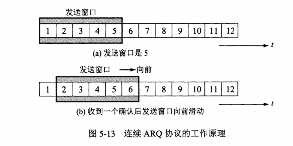
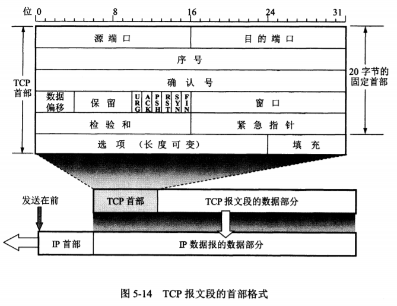
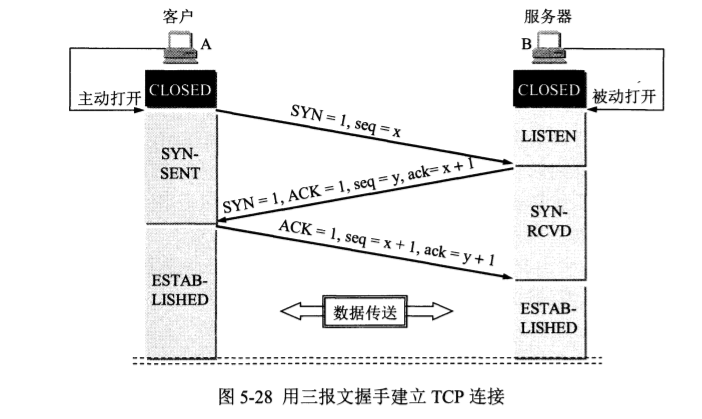
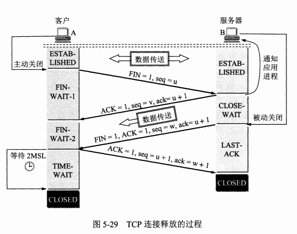

## 进程之间的通信
- 运输层向上面的应用层提供通信服务，ip协议只能解决到两台主机之间的通信
- 但是通信的真正端点并不是主机而是主机中的进程，也就是说端到端的通信是应用进程之间的通信。
- 运输层的重要功能是，复用和分用，即不同的主机

## 按照osi 两个对等运输实体在通讯时传输的数据单元叫运输数据单元，但是在tcp/udp 称为tcp报文段，或udp用户数据报

- tcp在传输数据之前不需要建立连接，目的主机的运输层在收到UDP报文之后，也不需要给出确认
- 运输层的端口，是应用层的各种协议进程与运输实体进行层间交互的一种地址。
- tcp/ip的运输层用一个16位端口号来标志一个端口，端口号具有本地意义，他是为了标志本计算机应用层中的各个进程在和运输层交互时的层间接口，2^16位端口号允许0-65535
- 两个计算机中的进程要通讯，不仅需要知道对方的ip地址，而且要知道对方的端口号。
- 服务端使用的端口号，这里又分为两类，一个是熟知端口号或者系统端口号0-1023，这些端口号是tcp/ip最终要的一些应用程序，
- 常用的端口号 
  
|ftp|telnet|smtp|dns|tftp|http|snmp|snmp|https|
|:-|:-:|:-:|:-:|:-:|:-:|:-:|:-:|-:|
|21|23|25|53|69|80|161|162|443|

- 另一类叫做登记端口号 1023-49151，这类端口号是没有熟知端口号的应用程序使用的，这类端口号必须在IANA按照规定的手续登记，防止重复
- 客户端使用的端口号，数值是49152-65535 这类端口号只在客户进程运行时才动态选择，也叫短暂端口号，这类端口号留给客户进程选择暂时使用。
  
##  用户数据报协议UDP

- UDP 是无连接的，即发送数据之前不需要建立连接
- UDP 使用的最大努力交付，即不保证可靠交付，也不需要维持复杂的连接状态
- UDP 是面向报文的，发送方的UDP对应用程序交下来的报文，在添加首部后就向下交付到ip层，既不合并，也不拆分。
- UDP 没有拥塞控制，因此网络出现拥塞不会使源主机的发送速率降低，这对某些实时应用很重要，比如视频会议。ip电话，要求源主机以恒定的速率发送数据，并且允许在网络发生拥塞时丢失一些数据，但是不允许数据有大量延时，UDP就很合适这种的。
- UDP 支持一对一，一对多，多对多，多对一，等交互通信
- UDP 的首部开销小，只有8个字节，比tcp20个字节的首部短

## 传输控制协议TCP transmission control protocol
- Tcp 是面向连接的运输层协议，在使用TCP协议之前，必须先建立TCP连接，在数据传输结束后，必须释放已经建立的TCP连接
- 每一条TCP连接只能有连个端点endpoint, 每一条TCP连接只能是点对点的
- TCP提交可靠交付的服务，通过TCP连接传输的数据，无差错，不丢失，不重复，并且按序到达。
- TCP提供全双工通信，TCP允许通信双方在应用进程任何时候发送数据，TCP连接的两端都设有发送缓存和接收缓存。
- 面向字节流，TCP中的流stream指的是流入到进程或从进程流出的字节序列。
- TCP连接的端点叫套接字（socket）或叫接口，端口号拼接到ip地址即构成了套接字
- 套接字socket = ip地址: 端口号
- 每一条TCP连接唯一的被通信两端的两个端点（即两个套接字）所确定。
- TCP连接 = {socket1, socket2} = {ip1: port1, ip2: port2}
  

## TCP 可靠传输的工作原理
TCP发送的报文段是交给网络层IP传送的，但是IP层只能提供尽最大努力服务的，也就是说TCP下面的网络所提供的还是不可靠的传输，因此TCP必须采用适当的措施才能变得可靠
最理想的传输是：传输信道不能产生差错，不管发送方发多快，接收方总是能及时处理收到的数据。
1. 但是实际情况可能是，比如我们传输的时候，当出现差错时让发送方重传出现差错的数据，同时在接收方来不及处理时可以通知发送方降低发送数据的速度。比如停止等待协议
2. ## 停止等待协议
全双工通信的意思是双方既是发送方又是接收方，停止等待就是每发送完一个分组(报文段)就停止发送，等待对方的确认，在收到确认后再发送下一个分组。
1. 无差错的情况，无差错的情况是最简单的情况

2. 出先差错，出现差错的情况有两种，一种是中途丢失了，第二个是速度慢传输超时了，这两种情况下接收方什么都不做，都不会发送确认消息。在可靠的传输协议里面：只要发送方超过一段时间没收到接收方的确认消息，就认为刚才发送的分组丢失了，因此就会重新发送上一个分组，这就是**超时重传**，实现超时重传就要设置一个超时计时器，在每次发送完一个分组时就设置一个超时计时器，在超时计时器到期之前收到接收方发来的确认消息，就撤销这个计时器
- 发送方在发送完一个分组后，需要暂时保留这个分组的副本，只有在确认受到相应的确认消息才清理这个分组的副本。
- 分组和确认分组必须进行编号，不然到时候分不清哪个分组没有收到确认消息
- 超时计时器设置的重传事件应该比数据分组传输的平均往返时间更长一点
- 当然超时计时器的时间周期是很难确定的，一般网络线路的延时，很多都是不确定的因素，时间设置过长，传输效率低下，时间设置过短，重传率变高，浪费网络资源
3. 确认丢失和确认迟到，一个是发送方的信息接收方收到，但是接收方发的确认消息丢失了，第二是接收方发送的确认消息超时停止了

- 发送方发送的分组接收方收到，但是发送方发的确认消息丢失，那么当发送方再次发送分组时，接收方并不会将重复的分组交付给上层，但是此时还是需要向发送方发送确认消息。
- 还有可能的情况是，确认迟到了，发送方重复发送消息，接收方第一次发送的确认消息迟到了，在之后接收到了，那么对重复的确认消息处理是：收下后就丢弃。
**确认重传机制在不可靠的传输网络上实现可靠的通信机制**
4. 信道利用率

- 等值等待协议的优点是简单，信道利用率太低。
- 为了提高传输效率，**发送方可以不用停止等待协议了，改用流水线传输**
- 流水线传输就是发送方可连续发送多个分组，不需要等到每发送完一个分组就要等待对方的确认信息，这样就可以让信道上一直有分组不断在传递，很明显这种方式传送效率更高，信道利用率更高，这种传送方式不是利用的停止等待协议，而是利用的**连续ARQ协议和滑动窗口协议**

## 连续ARQ协议
滑动窗口协议比较复杂是TCP协议的精髓。我们先了解连续ARQ协议。

- 连续滑动窗口协议的**接收方是采用累计确认的方式**，就是说接收方不一一对每个分组进行发送确认，而是在收到几个分组后，**对按序到达的最后一个分组发送确认**，表示到这个分组为止的所有分组都已经收到确认。
- **累计确认的方式也是有缺点的** 优点是容易实现，即使确认丢失也不必重新传递，但是缺点是不能向发送方反映接收方已经正确收到所有的分组信息
- 例如，五个分组，丢失中间第三个分组，接收方只能对前连个分组发送确认发送确认，发送方无法知道后面三个分组的下落，因此又要重新传递一个，这叫做回退go-back-n
  
## TCP 报文格式的首部格式
TCP是面向字节流的，但是TCP传送的数据单元是报文段，一个TCP报文段分为首部和数据两部分，而TCP的全部功能都体现在它首部
TCP报文段首部的前20个字段是固定的，后面有4n字节是根据需要而增加的选项，因此TCP首部的最小长度是20个字节

首部的各个字段含义
- 源端口和目的端口，各占两个字节，源端口号和目的端口号
- 序号，占4个字节，序号是【0，2^32】,TCP是面向字节流的，在一个TCP连接中传输的字节流中的每一个字节都按顺序编号，整个要传送字节流的起始序号必须是在连接建立时设置。序号是指**本报文段所发送的数据的第一个字段的序号，例如一个报文段值是301，而携带的数据共有100个字节，那么下一个报文段的数据序号应该是401，即下一个报文段的序号字段应为401，这个字段的名成也叫作 报文段序号**
- 确认号, 占4个字节，是期望收到对方下一个报文段的第一个数据字节的序号，例如，接收方收到了发送方发过来的一个报文段，序号字段值501，数据长度是200字节，那么表明接收方期望收到发送方的下一个数据序号是701，于是接收方发送确认消息时，发送的的确认号设置为701，**确认号 = N, 则表明序号N-1为止的所有数据都已经正确收到。**
- 数据偏移, 占4位，**表示TCP报文段的数据起始距离TCP报文段的起始处有多远，这个字段的实际意思是TCP报文段的首部长度，这是因为首部长度中有部分是不确定的可选项字段，因此数据偏移这个字段是必须的**，4位二进制的十进制数字最大是15，因为数据偏移的单位是32位（即4个字节为单位）所以 15*4 = 60 个字节，**因此TCP首部的最大字节数为60个字节，最大偏移数也是60个字节数**
- 保留，占6位，保留今后使用
- 紧急URG（URGent）urgent紧急，当URG=1时，表明紧急指针字段有效
- 确认ACK （ACKnowledgment）ACKnowledgment致谢，当ACK=1时确认号字段才有效，当ACK=0时，确认号无效，TCP规定，在连接建立后所有传送的报文段必须把ACK设置为1。
- 推送 PSH（push）当两个应用进程进行交互式通信时，有时在一端的应用进程希望在键入一个命令后立即就能收到对方的响应，这种情况下，TCP就可以使用推送操作。
- 复位 RST （reset）当RST =1 时，表明TCP连接中出现严重差错，必须重建连接。
- 同步 SYN （synchronization）, 在连接建立时用来同步序号的，当SYN = 1而ACK = 0时，表明这是一个连接请求报文段，对方如果同意建立连接，就在响应报文中设置SYN =1 ，ACK =1
- 终止 FIN （finish） 用来释放一个连接 ，当FIN = 1时，表示此报文段的发送方的传输数据完毕，并要求释放运输连接。
- 窗口，占两个字节，窗口指的是发送报文段的一方的接收窗口，**窗口指告诉对方: 从报文段首部中确认号算起，接收方目前允许对方发送的数据量，窗口值作为接收方让发送方设置其发送敞口的依据，窗口字段明确指出了现在允许对方发送的数据量，窗口值经常在动态变化着。**
## TCP的可靠传输的实现 以字节为单位的滑动窗口

## TCP的运输连接管理
TCP是面向连接的协议，运输连接是用来传送TCP，运输连接就有三个阶段：建立连接，数据传输，释放连接，TCP连接过程叫握手。握手需要在客户端和服务器之间交换三个TCP报文段。

- 一开始A主动打开连接，B被动打开连接
- B的TCP服务器进程先创建传输控制块TCB, 准备接受客户端的请求，然后服务端进程处于listen状态。
- A的TCP客户进程也是首先创建传输控制块TCB，然后在建立TCP连接时，向B发出连接请求报文段，这时设置首部中的同部位SYN = 1，同时选择一个初始序号seq = x,TCP规定，SYN报文段（即SYN =1 的报文段）不能携带数据，但是要消耗一个序号， B收到连接请求报文段后，如果同意建立连接，则向A发送确认消息，在确认报文段中应该把ACK和SYN都设置为1，确认号是ACK = x + 1，同时也为自己选择一个初始序号seq = y, 这个报文段也是不带数据的，同样消耗一个序号。
- 客户端进程收到B确认消息后，还要向B给出确认，确认报文段的ACK设置为1，确认号设置ack = y + 1, 而自己的序号 seq = x + 1, TCP规定，ACK报文段可以携带数据，但是如果不携带数据则不消耗序号，这种情况下，下一个数据报文段的序号任然为seq = x +1。
- 至此，TCP Lina连接已经建立，这就是三次握手的全过程。
## 四次握手，TCP连接释放
数据传输结束后，通信的双方都可释放连接，现在A和B都处在established(连接状态)，A的应用进程先向B发出释放连接报文段，并停止发送数据，主动关闭TCP连接，A把连接释放报文段首部的终止控制位FIN=1，其序列号为seq = u，他等于前面一传送过的数据的最后一个字节序号加1，这时A进入FIN-WAIT-1（终止等待1）状态，等待B的确认，TCP规定FIN报文段不携带数据，但是他还是消耗一个序列号，因此B端的确认号ack= u+1, 而这个报文段自己的序号是v, 等于B前面一传送过的数据的最后一个字节的序号加1，然后B进入CLOSE-WAIT（关闭等待）状态，TCP服务器进程这时通知高层应用进程，因而从A到B处于一个半连接的状态，A已经发送FIN =1，表明已经没有数据可传送了，但是B在这个期间还是可以传送数据的，A可以接受，但是传送不了。
A收到B的确认消息后，就进入了FIN-WAIT2状态，等待B发送连接释放报文段，在这期间B还可以发送数据给A，当B要发送的报文段也已经发送完毕，那么B就发送连接释放报文段，FIN=1，序号seq = w, 在释放连接之前可以发送数据报文段，B的发送过的确认号ack=u+1,这时B就进入了LAST—ACK（最后确认状态），等待A的确认。
A在收到B的连接释放报文后，必须对此发出确认，在报文段中的ACK置为1，确认号ack= w+1,序号为seq = u +1, 然后进入到一个TIME-wait 时间等待的状态，这个时间等待计时器一般是设置是2分钟。

